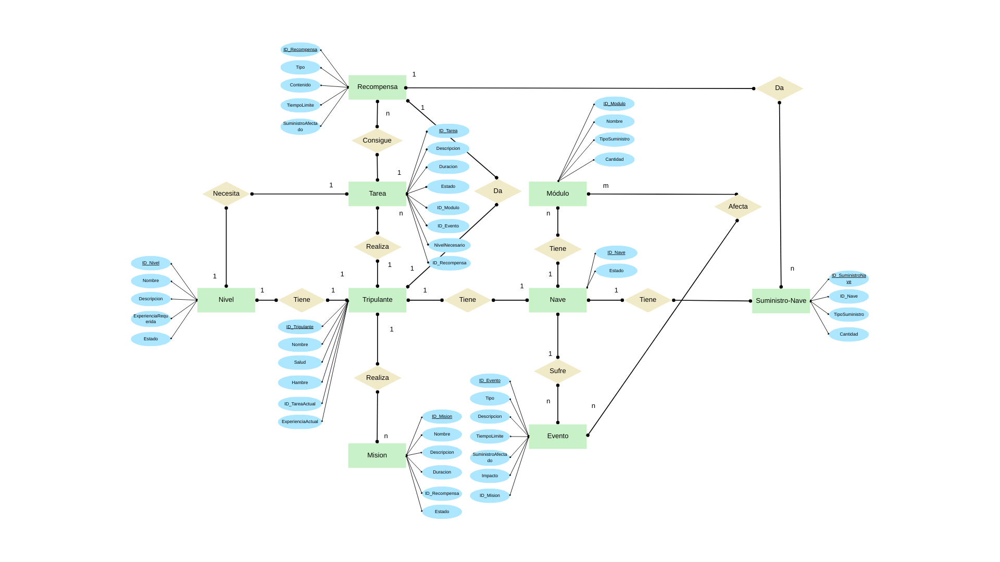

# Diagrama ER

## Estructura de las entidades y sus relaciones

### Nave
- **Campos**: ID_Nave (PK), Estado (enum: funcional/averiada)
- **Relaciones**:
    - Una nave TIENE muchos módulos (relación 1:N)
    - Una nave SUFRE muchos eventos (relación 1:N)
    - Una nave TIENE muchos suministros (relación 1:N con SuministroNave)
    - Una nave TIENE muchos tripulantes (relación 1:N)

### SuministroNave
- **Campos**: ID_SuministroNave (PK), ID_Nave (FK → Nave), TipoSuministro (enum: oxígeno/energía/comida/chatarra), Cantidad (INT)
- **Relaciones**:
    - Un suministro PERTENECE a una nave (relación N:1)
    - Una recompensa PUEDE DAR muchos suministros (relación 1:N)

### Módulo
- **Campos**: ID_Modulo (PK), Nombre (ej: motor, laboratorio), Estado (enum: funcional/dañado/destruido), ID_Nave (FK → Nave)
- **Relaciones**:
    - Un módulo PERTENECE a una nave (relación N:1)
    - Un módulo ES AFECTADO por muchos eventos (relación N:M)

### Tripulante
- **Campos**: ID_Tripulante (PK), Nombre (TEXT), Salud (INT 0-100), Hambre (INT 0-100), ID_TareaActual (FK → Tarea, NULL), ExperienciaActual (INT)
- **Relaciones**:
    - Un tripulante TIENE un nivel (relación 1:1)
    - Un tripulante REALIZA muchas tareas (relación 1:N)
    - Un tripulante REALIZA muchas misiones (relación 1:N)
    - Un tripulante PERTENECE a una nave (relación N:1)

### Nivel
- **Campos**: ID_Nivel (PK), Nombre (ej: Novato, Experto), Descripcion (TEXT), ExperienciaRequerida (INT), Estado (enum: desbloqueado/completado)
- **Relaciones**:
    - Un nivel ES ALCANZADO por un tripulante (relación 1:1)
    - Un nivel PUEDE SER REQUERIDO por una tarea (relación 1:1)

### Tarea
- **Campos**: ID_Tarea (PK), Descripcion (TEXT), Duracion (INT), Estado (enum: pendiente/en curso/completada), ID_Modulo (FK → Módulo), ID_Evento (FK → Evento, NULL), ID_Mision (FK → Mision, NULL), NivelNecesario (FK → Nivel, NULL), ID_Recompensa (FK → Recompensa, NULL)
- **Relaciones**:
    - Una tarea TIENE una recompensa (relación N:1)
    - Una tarea NECESITA un nivel específico (relación N:1)
    - Una tarea ES ASIGNADA a un tripulante (relación N:1)

### Evento
- **Campos**: ID_Evento (PK), Tipo (enum: fallo/sabotaje/etc.), Descripcion (TEXT), TiempoLimite (INT), SuministroAfectado (enum: oxígeno/energía/etc.), Impacto (TEXT), ID_Mision (FK → Mision, NULL)
- **Relaciones**:
    - Un evento AFECTA a una nave (relación N:1)
    - Un evento AFECTA a un modulo (relación N:M)

### Misión
- **Campos**: ID_Mision (PK), Nombre (TEXT), Descripcion (TEXT), Duracion (INT), ID_Recompensa (FK → Recompensa), Estado (enum: pendiente/activa/completada)
- **Relaciones**:
    - Una misión ES REALIZADA por tripulantes (relación N:M)

### Recompensa
- **Campos**: ID_Recompensa (PK), Tipo (enum: suministro/experiencia/desbloqueo), Contenido (ej: { "oxigeno": 10 }), CantidadExperiencia (INT, NULL), ID_EventoDesbloqueado (FK → Evento, NULL)
- **Relaciones**:
    - Una recompensa ESTÁ ASOCIADA a muchas tareas (relación 1:N)
    - Una recompensa PUEDE DAR suministros a la nave (relación 1:N)

---

---
